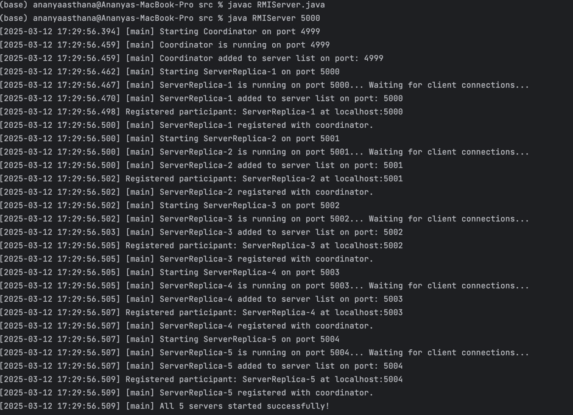
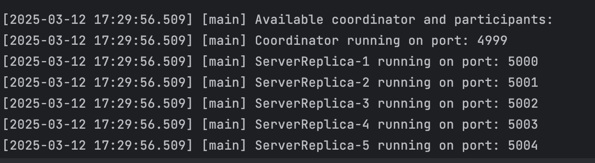
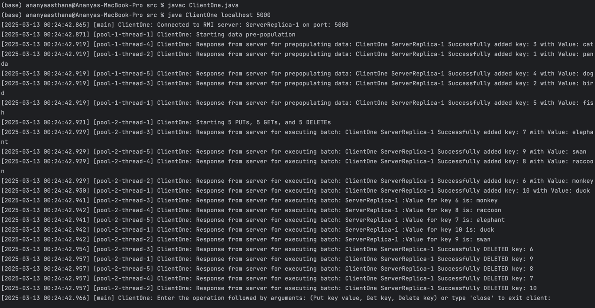
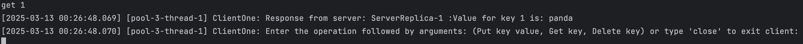
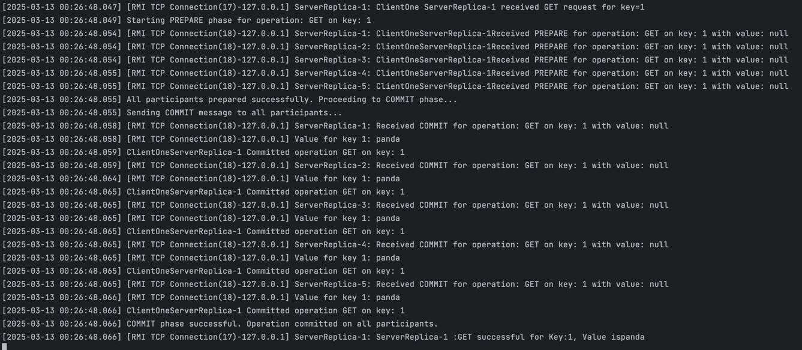
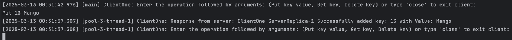
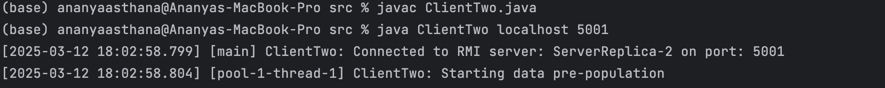
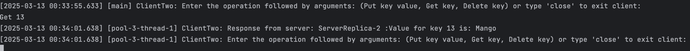
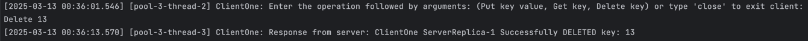
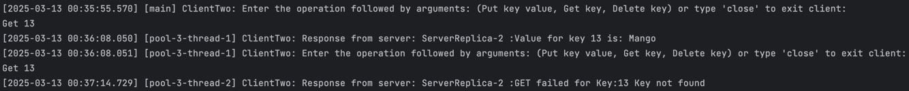

# RMI Multi-Server Program for String Operations with Two-Phase Commit

## Overview
This Java program implements a distributed key-value store using Java RMI (Remote Method Invocation) with a Two-Phase Commit (2PC) Protocol. The system consists of a Coordinator and multiple Participants (replicas) that handle key-value store operations (PUT, GET, DELETE) in a consistent and fault-tolerant manner.

1) Prepare Phase: The Coordinator asks all participants if they are ready to commit.
2) Commit Phase: If all participants agree to commit, the Coordinator sends a commit signal. If any participant fails or rejects, the Coordinator sends a rollback signal to maintain consistency.
3) Rollback Phase: If any node fails during commit, the rollback phase ensures that the state remains consistent across all replicas.

On the server side, Java RMI natively handles multithreading, meaning multiple client requests are processed concurrently without extra threading logic, and on the client side we use thread pools to send concurrent requests to the server instead of one after the other. ConcurrentHashMap used for thread safety.

We use one thread pool for prepopulation of data, one thread pool for the 5 PUTs, 5 GETs and 5 Deletes, and one thread pool for taking in user commands and executing them.
## Files
- **RMIServer.java**: Initializes the RMI registry, creates and registers the Coordinator and Participants.
- **ClientOne.java**: Connects to one of the servers, sends commands, and displays the server results. Uses a fixed-thread pool to send concurrent requests for better performance.
- **ClientTwo.java**: Second client for testing purposes. (See example below) Connects to one of the servers, sends commands, and displays the server results. Uses a fixed-thread pool to send concurrent requests for better performance.
- **KeyValueStoreOperations.java**: Implements the KeyValueStoreOperation interface and performs PUT, GET, DELETE logic
- **Participant.java** – Implements Participant interface. Represents all server replicas. Client connects to a participant and participant calls the 'InitiatePrepare' function of the coordinator, thus passing control to it.
- **Coordinator.java** – Implements Coordinator interface. Manages the 2PC flow (Prepare and Commit phases) and consistency. Implements Rollback if needed.

## How to Run
Unzip the files and store in your desired location. Then proceed with the given steps:

### 1. **Run the RMI Server**:
1. Open Terminal 1. We will run the RMI server here.
2. Navigate to the folder where the code is saved. Either use 'cd' to enter the src code folder where the unzipped files are or open a new terminal window at the src code folder.
3. Compile the server file:
```bash
javac RMIServer.java
```
4. Provide the port number
```bash 
java RMIServer <port>
````
If no port is provided, the server will ask for it again.
Once the connection is established, a list of ports where the server replicas have been started will be displayed.
The coordinator will be started on port - 1, where port is the port number provided by the user. All 5 server replicas will be started on port, port + 1 etc. up to port + 4 

### 2. **Run the First Client**:
1. Open Terminal 2. We will run the first client here.
2. Navigate to the folder where the code is saved. Either use 'cd' to enter the src code folder where the unzipped files are or open a new terminal window at the src code folder.
3. Compile the client file:
```bash
javac RMIClient.java
```
4. Provide the server address and port number from the list of port numbers displayed on the server
```bash
java RMIClient <server address> <port>
````

### 3. **Key Value Store operations**:
Once your client is up and running it will start to prepopulate all the Hashmap with 5 data points by running the following commands:

              "put 1 panda",
              "put 2 bird",
              "put 3 cat",
              "put 4 dog",
              "put 5 fish",

Then it will perform 5 PUT operations, 5 GET operations and 5 DELETE operations as follows:

              "put 6 monkey",
              "put 7 elephant",
              "put 8 raccoon",
              "put 9 swan",
              "put 10 duck",
              "get 6",
              "get 7",
              "get 8",
              "get 9",
              "get 10",
              "delete 6",
              "delete 7",
              "delete 8",
              "delete 9",
              "delete 10",

For all these operations, the participant will forward initiatePreparePhase request to the coordinator, who will send prepare request to all replicas. When it receives all true values, it will proceed to commitAll. If any errors occur it will rollback.
After this it will prompt the user to input any additional commands they wish to execute, as follows:

        Enter the operation followed by arguments: (Put key value, Get key, Delete key) or type 'close' to exit client:

Enter the operation with the required arguments to complete the operation execution. Enter 'close' to close client connection

## **Commands and Outputs**:
### On Terminal 1: 
```bash
javac RMIServer.java
java RMIServer 5000
```
You will now see this message:
```bash
[2025-03-12 17:29:56.509] [main] Available coordinator and participants:
[2025-03-12 17:29:56.509] [main] Coordinator running on port: 4999
[2025-03-12 17:29:56.509] [main] ServerReplica-1 running on port: 5000
[2025-03-12 17:29:56.509] [main] ServerReplica-2 running on port: 5001
[2025-03-12 17:29:56.509] [main] ServerReplica-3 running on port: 5002
[2025-03-12 17:29:56.509] [main] ServerReplica-4 running on port: 5003
[2025-03-12 17:29:56.509] [main] ServerReplica-5 running on port: 5004

```

### On Terminal 2:
```bash
javac ClientOne.java
java ClientOne localhost 5000
```

You will now see this message:
```bash
[2025-03-12 18:18:36.433] [main] ClientOne: Connected to RMI server: ServerReplica-1 on port: 5000
```
Now you will see all the responses for the prepopulation of data task as well as 5 PUTs, 5 GETs and 5 DELETEs

Next you will be prompted to enter your command as follows:
```bash
[2025-01-31 20:52:26.533] Enter the operation followed by arguments: (Put key value, Get key, Delete key) or type 'close' to exit client:
```

Request:
```bash
Put 15 apple
```
Response on server:
```bash
[2025-03-12 01:19:08.051] [RMI TCP Connection(14)-127.0.0.1] ServerReplica-2: Response from server for PUT: Successfully added key: 15 with value: apple
```

Response on client:
```bash
[2025-02-28 16:38:43.508] [pool-3-thread-1] Response from server: ClientOne ServerReplica-1 Successfully added key: 15 with Value: apple
```
**(For detailed complete logs with prepare and commit phase logs from coordinator, see next section. This section showed onnly the final log for every action.)**

### On Terminal 3:
```bash
javac ClientTwo.java
java ClientTwo localhost 5001
```
You are now connected to a different server from a different client and can test consistency to see if commands executed on other servers have propagated to this server.

## **View Detailed Output for an operation**:
Let's follow an example for command Put 4 dog, which is a prepopulation data command.

The responses from the server at every step will be displayed with timestamps and thread IDs on the client window as follows:

```bash
[2025-03-12 17:49:45.991] [pool-1-thread-5] ClientOne: Response from server for prepopulating data: ClientOne ServerReplica-1 Successfully added key: 4 with Value: dog
```

Similarly, server responses will be displayed in the server window with timestap and RMI thread ID. 
1. **Prepare**
```bash
[2025-03-12 01:19:08.017] [RMI TCP Connection(15)-127.0.0.1] ServerReplica-1: ClientOneServerReplica-1Received PREPARE for operation: PUT on key: 4 with value: dog   
[2025-03-12 01:19:08.017] [RMI TCP Connection(15)-127.0.0.1] ServerReplica-2: ClientOneServerReplica-2Received PREPARE for operation: PUT on key: 4 with value: dog
[2025-03-12 01:19:08.017] [RMI TCP Connection(15)-127.0.0.1] ServerReplica-3: ClientOneServerReplica-3Received PREPARE for operation: PUT on key: 4 with value: dog 
[2025-03-12 01:19:08.017] [RMI TCP Connection(15)-127.0.0.1] ServerReplica-4: ClientOneServerReplica-4Received PREPARE for operation: PUT on key: 4 with value: dog  
[2025-03-12 01:19:08.017] [RMI TCP Connection(15)-127.0.0.1] ServerReplica-5: ClientOneServerReplica-5Received PREPARE for operation: PUT on key: 4 with value: dog
[2025-03-12 01:19:08.041] All participants prepared successfully. Proceeding to COMMIT phase...
[2025-03-12 01:19:08.041] Sending COMMIT message to all participants...
```

2. **Commit**

```bash
[2025-03-12 01:19:08.043] [RMI TCP Connection(15)-127.0.0.1] ServerReplica-1: Received COMMIT for operation: PUT on key: 4 with value: dog
[2025-03-12 01:19:08.043] [RMI TCP Connection(15)-127.0.0.1] ServerReplica-2: Received COMMIT for operation: PUT on key: 4 with value: dog 
[2025-03-12 01:19:08.043] [RMI TCP Connection(15)-127.0.0.1] ServerReplica-3: Received COMMIT for operation: PUT on key: 4 with value: dog   
[2025-03-12 01:19:08.043] [RMI TCP Connection(15)-127.0.0.1] ServerReplica-4: Received COMMIT for operation: PUT on key: 4 with value: dog  
[2025-03-12 01:19:08.043] [RMI TCP Connection(15)-127.0.0.1] ServerReplica-5: Received COMMIT for operation: PUT on key: 4 with value: dog
[2025-03-12 01:19:08.050] ClientOneServerReplica-1Committed operation PUT on key: 4
[2025-03-12 01:19:08.050] ClientOneServerReplica-2Committed operation PUT on key: 4
[2025-03-12 01:19:08.050] ClientOneServerReplica-3Committed operation PUT on key: 4
[2025-03-12 01:19:08.050] ClientOneServerReplica-4Committed operation PUT on key: 4
[2025-03-12 01:19:08.050] ClientOneServerReplica-5Committed operation PUT on key: 4
```

3. **Success**
```bash
[2025-03-12 01:19:08.051] [RMI TCP Connection(14)-127.0.0.1] ServerReplica-2: Response from server for PUT: Successfully added key: 4 with value: dog
```

## **Example**:

### 1. Server compilation and registration of coordinator and participants/replicas:

### 2. Server displaying available participants/replicas:

### 3. Client side compilation, connection to a server replica, prepopulation of data and 15 command executions (5 PUTs, 5 GETs, 5 DELETEs):

### 4. Client side execution of user command - get 1:

Used 3 thread pools with 5 threads each to perform prepopulation, 5 PUTs, 5 GETs and 5 DELETEs, and command execution
### 5. Server side execution of user command - get 1 - with coordinator initiating prepare and commit across all replicas:

Used RMI Connection Threads for multithreading

## **Testing consistency and replication across all server replicas**:

### Put a key on serverReplica-1 through clientOne:


### Get same key on serverReplica-2 through clientTwo - key is displayed as consistency is maintained:



### Delete same key on serverReplica-1 through clientOne:


### Get same key on serverReplica-2 through clientTwo - It fails as key was deleted:

Here, the first get operation happens before key was deleted on serverReplica-1 and second get operation happens after it was deleted. Thus, serverReplica-2 shows key not found.
